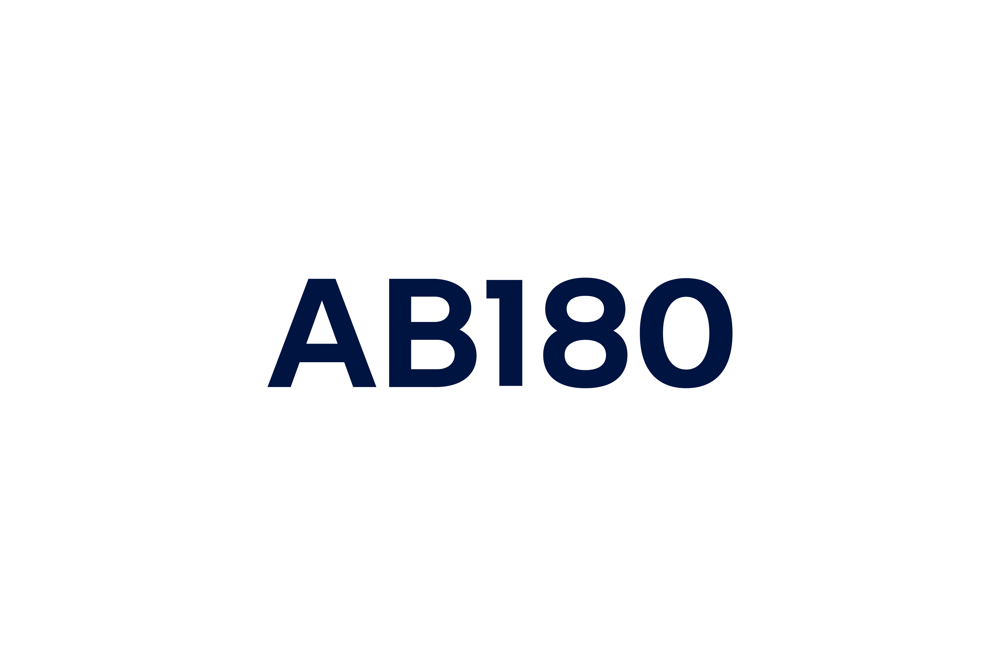
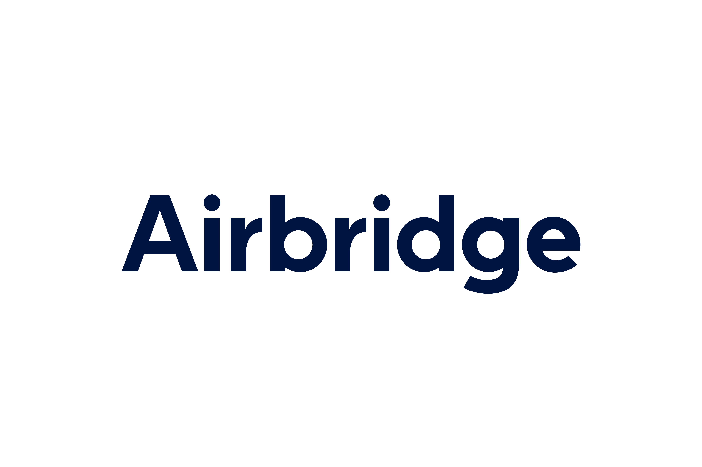

# Airbridge Entry API

<p align="center">
  <picture>
    <source media="(prefers-color-scheme: dark)" srcset="assets/ab180-logo-dark.png">
    <source media="(prefers-color-scheme: light)" srcset="assets/ab180-logo-light.png">
    
  </picture>
  &nbsp;&nbsp;&nbsp;&nbsp;
  <picture>
    <source media="(prefers-color-scheme: dark)" srcset="assets/airbridge-logo-dark.png">
    <source media="(prefers-color-scheme: light)" srcset="assets/airbridge-logo-light.png">
    
  </picture>
</p>

<p align="center">
  <a href="https://airbridge-entry-api.vercel.app"><strong>🌐 airbridge-entry-api.vercel.app</strong></a>
</p>

> 개인화, CRM, 리타겟팅, 추천 엔진 — 전부 유저가 남아있어야 의미 있는 것들입니다.
>
> 문제는, **대부분의 유저가 그 전에 떠난다는 겁니다.**

---

## 퍼널의 가장 처음을 놓치면, 그 뒤의 모든 노력은 소수에게만 닿습니다

수천 원에서 수만 원을 써서 데려온 유저가 앱을 열었습니다. 그리고 **대부분이 첫 세션에서 아무것도 하지 않고 떠납니다.** 이 유저를 첫 순간에 잡지 못하면, 돌아오지 않습니다.

그동안 업계는 유저가 떠난 뒤에 돈을 쓰고 있었습니다 — 리타겟팅, 푸시, CRM. 업계가 자랑하는 수많은 머신러닝과 개인화 기술들도 결국 **살아남은 1~20%의 유저**가 대상입니다. 정작 대부분의 유저가 이탈하는 **첫 순간**에는 아무 기술도 작동하지 않고 있었습니다.

왜 아무도 이걸 못 풀었을까요? **신규 유저는 데이터가 없기 때문입니다.** 구매 이력도 없고, 행동 데이터도 없고, 아무것도 없습니다. 그래서 모든 신규 유저에게 똑같은 첫 경험을 보여줄 수밖에 없었습니다.

**하지만 Airbridge에게는 데이터가 있습니다.**

모바일 생태계에서 유저와 앱의 상호작용은 설치 순간에 시작되는 게 아닙니다. **광고를 처음 본 그 순간부터 이미 시작**되어 있습니다. Airbridge는 그 시작점부터 데이터를 갖고 있습니다 — **멀티터치포인트 광고 여정**. Google, Meta, TikTok 등 각 매체가 최신 머신러닝으로 타겟팅한 결과, 유저가 어떤 광고에 어떻게 반응했는지가 모두 기록되어 있습니다. 어떤 채널에서 몇 번 노출됐는지, 어떤 광고를 클릭했는지, 설치까지 얼마나 고민했는지 — **매체들이 쏟아부은 수십억 원의 ML 최적화가 만들어낸 시그널**이 이 데이터 안에 들어있습니다.

이 데이터를 가진 플랫폼은 **MMP인 Airbridge뿐**입니다.

Airbridge는 다수의 커머스 앱, 수십만 명의 유저를 분석하며 **퍼널의 가장 처음에서 유저를 잡을 수 있는 방법**을 찾아왔습니다.

그 결과가 **Airbridge Entry API**입니다.

---

## 5분 안에, 4가지를 알려줍니다

신규 유저가 앱을 열고 5분이 지나면:

1. **이 유저에게 어떤 메시지를 보여줘야 하는지** — 할인? 인기상품? 한정세일? 신상품?
2. **이 유저가 3일 내 구매할 확률** — 고가치 유저에게 쿠폰을 집중
3. **이 유저가 3일 내 이탈할 확률** — 이탈 위험 유저를 먼저 잡기
4. **이 유저의 30일 예상 LTV 등급** — high / medium / low 3단계로 유저 가치 분류

멀티터치포인트 광고 여정 데이터 + 앱 진입 후 첫 5분 행동을 결합해서, **다른 누구도 데이터가 없다고 포기한 그 순간에** 실시간으로 분석합니다.

```
앱 오픈 → 5분 경과 → API 호출 (app_id + uuid만) → 즉시 응답
```

### 4가지 메시지 유형

마케팅 연구에서 소비자의 구매 행동을 이끄는 심리적 자극은 크게 4가지로 분류됩니다 — Thaler의 거래 효용 이론(Transaction Utility), Cialdini의 사회적 증거 및 희소성 원칙(Principles of Persuasion), Hirschman의 새로움 탐색(Novelty Seeking). 사람마다 반응하는 자극이 다릅니다. API는 유저별로 가장 효과적인 유형을 알려줍니다:

| 메시지 유형 | 심리적 자극 | 앱에서 보여줄 것 (예시) |
|------------|------------|----------------------|
| **Price Appeal** | 경제적 이득감 (Transaction Utility) | "첫 구매 20% 할인 쿠폰이 도착했어요" |
| **Social Proof** | 다른 사람들의 선택 (Social Proof) | "지금 1,234명이 보고 있는 인기 상품" |
| **Scarcity** | 놓치면 손해 (Loss Aversion) | "3개 남음, 오늘 자정 종료" |
| **Novelty** | 새로운 것 탐색 (Novelty Seeking) | "이번 주 새로 들어온 아이템 보기" |

**API가 알려주는 건 메시지 유형**입니다. 구체적인 문구, 디자인, 모달 형태는 앱에서 자유롭게 만들면 됩니다.

---

## 왜 믿을 수 있는가

### 검증된 예측 정확도

Airbridge를 사용하는 다수의 앱 데이터를 분석하여 실제로 검증했습니다.

**3일 내 구매 예측**

| 지표 | 결과 |
|------|------|
| 모델이 "구매할 것"이라 예측한 상위 10% 유저의 실제 구매율 | **94.7%** |
| 모델이 "안 살 것"이라 예측한 하위 10% 유저의 실제 구매율 | **0.6%** |
| 상위 vs 하위 차이 | **154배** |

→ 모델이 "이 유저는 구매할 확률이 높다"고 하면, **진짜 구매합니다.**

**3일 내 이탈 예측**

| 지표 | 결과 |
|------|------|
| 모델이 "이탈할 것"이라 예측한 상위 10%의 실제 이탈률 | **81.2%** |
| 모델이 "안 떠날 것"이라 예측한 하위 10%의 실제 이탈률 | **11.9%** |

→ 이탈 위험 유저를 사전에 식별하고, 먼저 손을 쓸 수 있습니다.

**30일 LTV 예측 (pLTV)**

| 지표 | 결과 |
|------|------|
| 모델이 "고가치"로 분류한 상위 20% 유저의 실제 평균 LTV | **110,000원** |
| 모델이 "저가치"로 분류한 하위 50% 유저의 실제 평균 LTV | **250원** |
| 상위 vs 하위 차이 | **440배** |

→ 쿠폰을 누구에게 줄지, 얼마짜리를 줄지 **데이터로 결정**할 수 있습니다.

### Airbridge만 할 수 있는 이유

다른 솔루션은 신규 유저에게 데이터가 없어서 포기합니다. Airbridge는 다릅니다:

| 데이터 | 예측 정확도 | 누가 갖고 있나 |
|--------|-----------|--------------|
| 디바이스 정보만 (기종, OS) | 거의 없음 | 누구나 |
| **멀티터치포인트 광고 여정** | **높음** | **Airbridge만** |
| 첫 5분 인앱 행동 | 높음 | SDK 사용 앱 |
| **광고 여정 + 첫 5분 결합** | **매우 높음** | **Airbridge만** |

광고 여정 데이터는 "이 유저가 어떤 사람인지"를, 인앱 행동은 "지금 뭘 원하는지"를 알려줍니다. **이 두 데이터를 동시에 가진 건 MMP인 Airbridge뿐**이고, 둘을 합치면 어느 하나만 쓸 때보다 훨씬 정확해집니다.

### 메시지 추천은 실험과 Airbridge의 Causal ML 기술로 검증됩니다

"이 유저에게 이 메시지가 효과적이다"는 단순 추측이 아니라, **실험으로 검증해가는 인과 관계**입니다. 4가지 메시지 유형(Price Appeal, Social Proof, Scarcity, Novelty) 중 어떤 것이 각 유저에게 효과적인지를, RCT(무작위 대조 실험)로 데이터를 모으고 Airbridge의 Causal ML 모델로 인과적으로 추정합니다.

```
[처음 일정 기간: 실험 단계]

  모든 신규 유저에게 4가지 메시지를 완전히 랜덤으로 보여줍니다.
  
  유저 A → 할인 메시지 (랜덤) → 클릭 O
  유저 B → 인기상품 메시지 (랜덤) → 클릭 X
  유저 C → 할인 메시지 (랜덤) → 클릭 X  
  유저 D → 인기상품 메시지 (랜덤) → 클릭 O
  ...
  
  랜덤이니까 "비슷한 유저가 다른 메시지를 받았을 때 반응이 달랐다"
  = 인과 관계

[실험 후: 자동 최적화]

  실험 데이터를 학습한 인과 모델이 유저별 최적 메시지를 추천합니다.
  
  80%: 모델이 추천한 메시지 배정 (성과 최적화)
  20%: 랜덤 배정 유지 (새 데이터 수집 → 모델이 계속 정확해짐)
```

**앱에서는 아무것도 바꿀 필요 없이**, API 응답이 알아서 실험 → 최적화로 전환됩니다.

---

## Try It

### 1. API 호출

`app_id`와 `airbridge_uuid`만 보내면 됩니다. 나머지는 Airbridge가 알아서 합니다.

> **참고**: 데모 서버는 15분간 요청이 없으면 슬립 모드에 들어갑니다. 첫 요청 시 서버가 깨어나는 데 약 30초가 걸릴 수 있으며, 이후 요청은 즉시 응답합니다. 실서비스에서는 발생하지 않습니다.

```bash
curl -X POST https://airbridge-entry-api-prototype.onrender.com/v1/entry/predict \
  -H "Content-Type: application/json" \
  -d '{
    "app_id": "ablog",
    "airbridge_uuid": "363c178f-ad44-4e18-ad81-ed098e28919f"
  }'
```

### 2. 응답

```json
{
  "user_id": "363c178f-ad44-4e18-ad81-ed098e28919f",
  "best_trigger": "social_proof",
  "trigger_scores": {
    "price_appeal": 0.17,
    "social_proof": 0.26,
    "scarcity": 0.19,
    "novelty": 0.21
  },
  "is_random": false,
  "d3_purchase_prob": 0.14,
  "d3_churn_prob": 0.41,
  "pltv": {
    "tier": "high",
    "percentile": 85,
    "tier_avg_ltv": 110019
  }
}
```

### 3. 응답 해석

| 필드 | 쉽게 말하면 | 어떻게 쓰면 되나 |
|------|-----------|----------------|
| `best_trigger` | 이 유저에게 가장 효과적인 메시지 유형 | 이 유형에 맞는 모달/인앱메시지를 보여주세요 |
| `trigger_scores` | 4가지 메시지 유형 각각의 클릭 확률 | 더 세밀하게 분기하고 싶을 때 |
| `is_random` | 이 배정이 랜덤 실험인지 여부 | `true`면 실험 데이터 (CATE 학습용), `false`면 모델 추천 |
| `d3_purchase_prob` | 이 유저가 3일 내 구매할 확률 | 높으면 → 공격적 쿠폰, 낮으면 → 쿠폰 아낌 |
| `d3_churn_prob` | 이 유저가 3일 내 이탈할 확률 | 높으면 → 리텐션 메시지 우선 |
| `pltv.tier` | 이 유저의 30일 예상 가치 등급 | `high` → VIP 쿠폰, `medium` → 일반 쿠폰, `low` → 쿠폰 절약 |
| `pltv.percentile` | 전체 유저 중 LTV 백분위 (0~99) | 숫자가 높을수록 고가치 유저 |
| `pltv.tier_avg_ltv` | 해당 등급의 평균 LTV (원) | 쿠폰 금액 결정의 기준 |

### 4. 앱에서 이렇게 쓰면 됩니다

```
유저 앱 오픈
  → 5분 후 API 호출
  → best_trigger = "social_proof"
  → "지금 1,234명이 보고 있는 인기 상품" 모달 표시

또는

  → best_trigger = "price_appeal" + pltv.tier = "high"
  → VIP 유저 + 가격에 반응하는 유형 → "첫 구매 20% 할인" 프리미엄 쿠폰 모달

또는

  → d3_churn_prob = 0.85 + pltv.tier = "medium"
  → 이탈 위험 높은 잠재 고객 → best_trigger에 맞는 긴급 리텐션 메시지

또는

  → pltv.tier = "low"
  → 쿠폰 예산 절약, 기본 환영 메시지만
```

### 5. 테스트용 샘플 UUID

```
363c178f-ad44-4e18-ad81-ed098e28919f
56101c87-4ced-482e-9459-2675c833afe5
6d1519a4-7147-4ecf-8ed5-069306d167cd
```

전체 목록: `GET /v1/users/ablog` (500명)

---

## 연동하기

### 당신이 해야 할 것 (3가지만)

**1. Airbridge SDK 이벤트 태깅**

이미 Airbridge SDK를 쓰고 있다면 대부분 완료되어 있습니다. 아래는 예시이며, 앱 내 주요 이벤트를 태깅해주시면 됩니다:

| 이벤트 | 필수 | 비고 |
|--------|------|------|
| `product.viewed` | 필수 | 상품 상세 조회 |
| `user.signin` | 필수 | 로그인 |
| `product.addedtocart` | 필수 | 장바구니 담기 |
| `order.completed` | **필수** | 구매 완료 — **구매 금액(revenue) 포함 필수** (pLTV 예측에 사용) |
| `home.viewed` | 권장 | 홈 화면 조회 |

> **중요**: `order.completed` 이벤트에 **구매 금액(revenue)**을 반드시 포함해야 pLTV(예상 유저 가치) 예측이 가능합니다. 태깅 방법은 [Airbridge 이벤트 구성요소 가이드](https://help.airbridge.io/ko/guides/airbridge-event-elements)를 참고하세요.

**2. 4가지 메시지 유형별 화면 디자인**

모달, 인앱메시지, 배너, 팝업 — 어떤 방식으로 유저에게 메시지를 던질지는 자유입니다. 단, **4가지 유형의 포맷을 동일하게 맞춰주세요** (예: 전부 모달, 또는 전부 배너 등). 포맷이 같아야 실험이 공정하고, 추천 모델 학습이 빨라집니다.

| 유형 | 핵심 메시지 | 예시 |
|------|-----------|------|
| Price Appeal | 할인/쿠폰 강조 | "첫 구매 20% 할인 쿠폰이 도착했어요" |
| Social Proof | 인기/랭킹 강조 | "지금 가장 많이 팔리는 상품 보기" |
| Scarcity | 한정/긴급성 강조 | "오늘만! 이 가격에 만나보세요" |
| Novelty | 신상품/트렌드 강조 | "이번 주 새로 들어온 아이템" |

구체적인 문구와 디자인은 자유입니다. API는 **유형만** 알려줍니다.

**3. 모달 클릭 이벤트 태깅**

유저가 모달/인앱메세지 등에  반응했는지를 Airbridge SDK로 보내주세요. 모델 훈련의 핵심 데이터입니다:

```
이벤트명: entry_modal_shown    (모달 노출 시)
이벤트명: entry_modal_clicked  (모달 클릭 시)
속성: { "trigger_type": "social_proof" }
```

이 데이터로 모델이 계속 학습합니다. 시간이 지날수록 더 정확해집니다.

### 나머지는 전부 저희가 합니다

| 우리가 하는 것 | 설명 |
|---------------|------|
| 광고 여정 + 인앱 데이터 수집/처리 | Airbridge SDK가 이미 하고 있는 것 |
| 유저별 실시간 데이터 관리 | Feature Store 구축/운영 |
| 모델 학습 및 서빙 | 메시지 추천 + 구매/이탈 예측 + pLTV 등급 분류 |
| 실험 설계 및 운영 | 랜덤 실험 → 자동 최적화 전환 |
| 모델 주기적 재학습 | 새 데이터 반영하여 정확도 지속 개선 |
| API 서버 운영 | 200ms 이내 응답 |

---

## API Reference

### 예측 요청

```
POST /v1/entry/predict
```

Request:
```json
{
  "app_id": "ablog",
  "airbridge_uuid": "363c178f-ad44-4e18-ad81-ed098e28919f"
}
```

Response:
```json
{
  "user_id": "363c178f-ad44-4e18-ad81-ed098e28919f",
  "best_trigger": "social_proof",
  "trigger_scores": {
    "price_appeal": 0.17,
    "social_proof": 0.26,
    "scarcity": 0.19,
    "novelty": 0.21
  },
  "is_random": false,
  "d3_purchase_prob": 0.14,
  "d3_churn_prob": 0.41,
  "pltv": {
    "tier": "high",
    "percentile": 85,
    "tier_avg_ltv": 110019
  }
}
```

> `pltv`는 구매 금액 데이터가 충분할 때 제공됩니다. 데이터가 없으면 `null`로 반환됩니다.

### 서버 상태 확인

```
GET /health
```

### 테스트 유저 목록

```
GET /v1/users/{app_id}
```

---

*Airbridge Entry API — 퍼널의 첫 순간부터 개인화합니다.*
